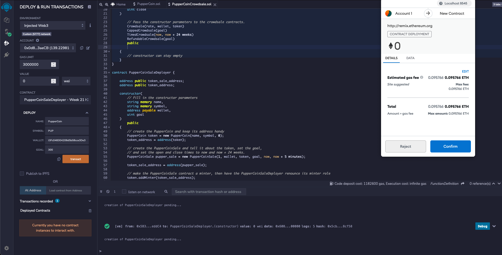
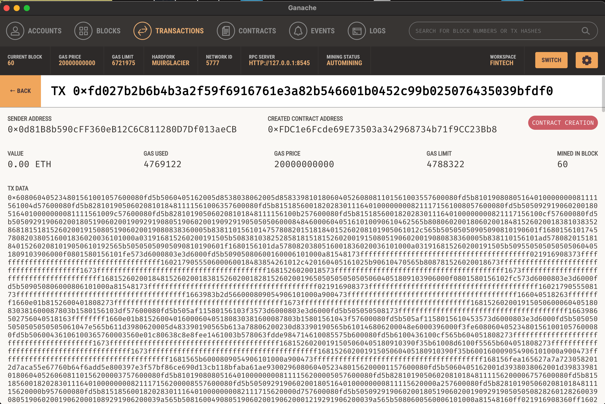
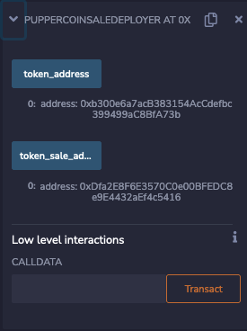
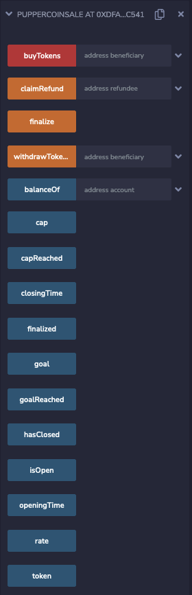
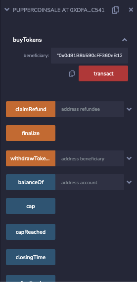

# Pupper Coin ICO
----

## Background
Your company has decided to crowdsale their PupperCoin token in order to help fund the network development.
This network will be used to track dog breeding activity across the globe in a decentralized way, and allow humans to track the genetic trail of their pets. You have already worked with the necessary legal bodies and obtained the green light on creating a crowdsale open to the public. However, you are required to enable refunds if the crowdsale is successful and the goal is met, and you are only allowed to raise a maximum of 300 ether. The crowdsale will run for 24 weeks.

You will need to create an ERC20 token that will be minted through a Crowdsale contract that you can leverage from the OpenZeppelin Solidity library.

This crowdsale contract will manage the entire process, allowing users to send ETH and get back PUP (PupperCoin).
This contract will mint the tokens automatically and distribute them to buyers in one transaction.

It will need to inherit Crowdsale, CappedCrowdsale, TimedCrowdsale, RefundableCrowdsale, and MintedCrowdsale.

You will conduct the crowdsale on the Kovan or Ropsten testnet in order to get a real-world pre-production test in.

----

1. Compile and deploy the contract

2. Check that the contract was deployed correctly on Ganache

3. Grab the token and sale contract address for later

4. Input the sale contract address into the 'At Address' button on remix to interact with the sale contract

5. Choose another address to buy the tokens with and transact

Congratulations! You just created your own crowdsale with a goal, start and end times and a cap which if not reached the contrasct will refund the buyers of the coin!